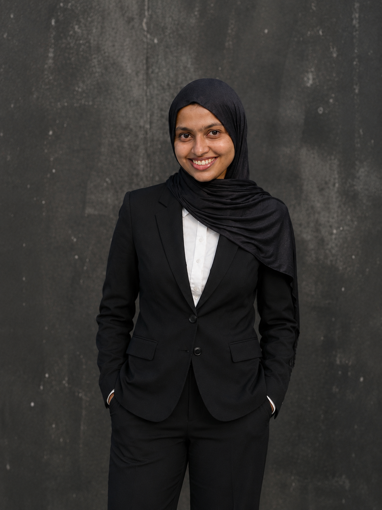

<h1 align="center">Hi 👋, I'm Salma Dariya</h1>

  

<h3 align="center">B.Tech Computer Science Engineering Student</h3>

---

## 👩‍💻 About Me

- 🎓 B.Tech Computer Science Engineering Student
- 💻 Interested in Frontend Development
- 🌱 Currently learning React, Git and GitHub
- 🚀 Passionate about building web applications
- 📍 Kerala, India

---

## 🛠️ Skills

### Programming Languages
- C
- Java
- JavaScript

### Web Development
- HTML
- CSS
- React
- Tailwind CSS

### Tools & Technologies
- Git
- GitHub
- VS Code

---

## 📂 Projects

### CTDS Workforce Management System

A web-based workforce management application developed to streamline employee management processes.

#### Features
- Employee Dashboard
- Attendance Management
- Leave Requests
- Task Tracking
- KPI Monitoring
- Notifications

#### Technologies Used
- React
- Vite
- Tailwind CSS
- Git & GitHub

---

## 📚 Currently Learning

- React Development
- Git & GitHub
- Frontend Best Practices

---

## 🎯 Career Goal

To become a skilled Frontend Developer and build modern, user-friendly web applications.

---

## 📫 Connect With Me

- GitHub: https://github.com/salmadariya

---

⭐ Thank you for visiting my profile!
